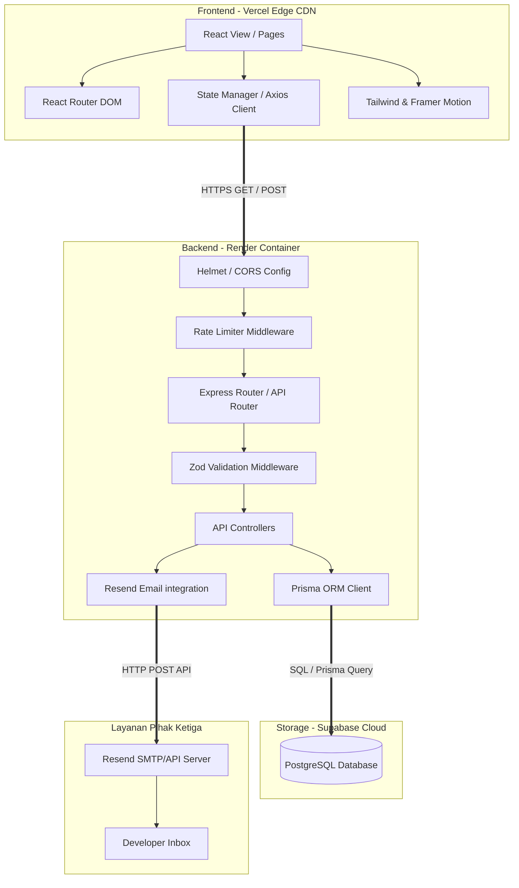
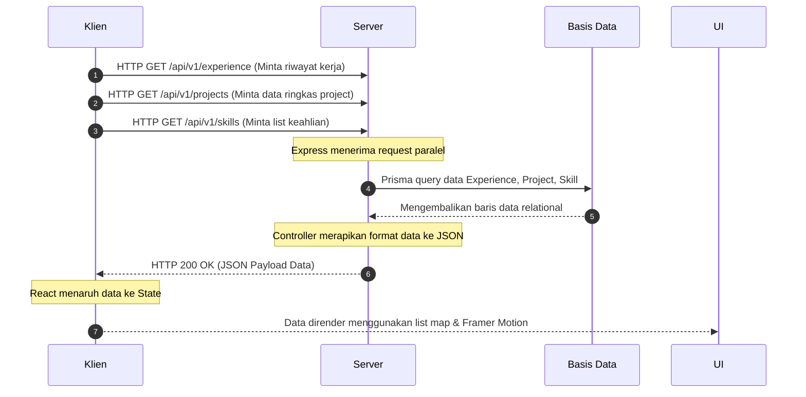
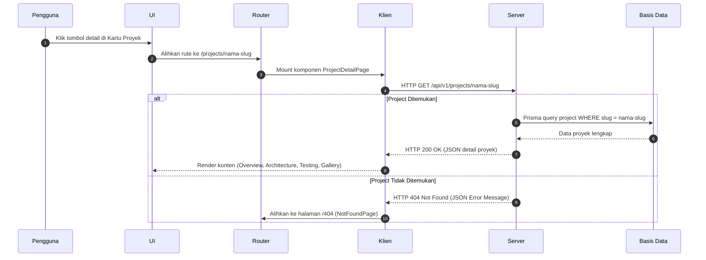
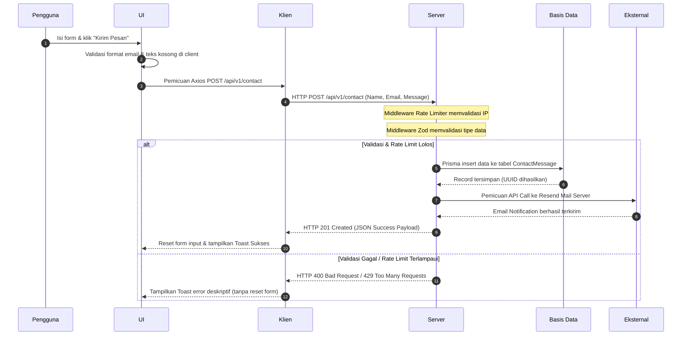

# 02. ARSITEKTUR SISTEM (SYSTEM ARCHITECTURE)

Dokumen ini menjelaskan struktur arsitektur sistem, desain komponen, dan aliran data yang digunakan untuk membangun Website Portfolio Pribadi. Arsitektur ini dirancang untuk memastikan pemisahan tanggung jawab (*separation of concerns*), performa tinggi, dan skalabilitas di masa depan.

---

## 1. Tinjauan Umum Arsitektur (Architecture Overview)

Aplikasi ini menggunakan arsitektur **Client-Server** dengan pola **Single Page Application (SPA)** pada sisi klien. Komunikasi antara klien dan server dilakukan secara asinkronus menggunakan protokol HTTP melalui RESTful API.

```
+-------------------------------------------------------------+
|                       LAPISAN KLIEN                         |
|  - React.js (Vite)                                          |
|  - Tailwind CSS & Framer Motion (UI/UX)                     |
|  - Axios (Panggilan API)                                    |
+-------------------------------------------------------------+
                              |
                     Request (HTTPS JSON)
                              |
                              v
+-------------------------------------------------------------+
|                       LAPISAN SERVER                        |
|  - Node.js & Express.js (REST API)                          |
|  - Zod (Validasi Request)                                   |
|  - Prisma Client (ORM Database Query)                       |
+-------------------------------------------------------------+
         |                                           |
  Prisma Client Query                           API Trigger
         |                                           |
         v                                           v
+-----------------------+                   +-----------------+
|   LAPISAN DATABASE    |                   | LAYANAN EKSTERNAL|
|  - PostgreSQL         |                   |  - Resend Email |
|    (Hosted Supabase)  |                   |    Service API  |
+-----------------------+                   +-----------------+
```

---

## 2. Diagram Arsitektur Detail (Detailed Architecture Diagram)

Diagram berikut menjelaskan bagaimana komponen-komponen di dalam aplikasi berinteraksi secara spesifik, termasuk aliran keamanan dan integrasi email eksternal:



---

## 3. Evaluasi & Rasionalisasi Stack Teknologi

Pemilihan teknologi dalam proyek ini didasarkan pada standar industri, kemudahan pemeliharaan, serta performa eksekusi:

### 3.1 Frontend Stack
*   **React.js (Vite)**: React dipilih karena arsitekturnya yang berbasis komponen (*component-based*), memudahkan pembuatan elemen UI yang dapat digunakan kembali (*reusable*). Vite digunakan sebagai build tool menggantikan Create React App karena kecepatan *bundling* yang luar biasa dan fitur *Hot Module Replacement* (HMR) yang instan.
*   **Tailwind CSS**: Menyediakan metodologi *utility-first* untuk penulisan gaya langsung pada markup. Ini mempercepat penulisan kode CSS, memastikan ukuran file CSS akhir yang kecil pasca-proses *purging*, dan memudahkan penerapan desain responsif.
*   **React Router DOM**: Pustaka routing standar untuk React. Memungkinkan transisi navigasi antar halaman (seperti halaman utama ke detail proyek) tanpa memicu pemuatan ulang halaman penuh (*full page reload*), menjaga karakteristik SPA yang cepat.
*   **Axios**: Klien HTTP berbasis *promise* untuk berkomunikasi dengan API. Menyediakan fitur *interceptors*, penanganan pembatalan request (*cancel tokens*), serta serialisasi data JSON otomatis yang lebih andal dibanding Fetch API bawaan browser.
*   **Framer Motion**: Pustaka animasi yang kuat untuk React. Digunakan untuk transisi halaman yang mulus dan animasi *scroll* mikro untuk menciptakan pengalaman pengguna yang premium tanpa mengorbankan stabilitas performa.

### 3.2 Backend Stack
*   **Node.js & Express.js**: Express.js adalah framework minimalis berbasis Node.js yang sangat populer untuk membuat API RESTful. Model I/O non-blocking yang digunakannya sangat efisien dalam menangani panggilan I/O database dan integrasi email eksternal secara asinkronus.
*   **Prisma ORM**: Menyediakan lapisan abstraksi basis data yang type-safe. Dengan Prisma, pengembang dapat berinteraksi dengan database PostgreSQL menggunakan objek JavaScript yang jelas, mengurangi kesalahan query manual, dan memfasilitasi migrasi skema basis data dengan aman.
*   **Zod**: Pustaka deklarasi skema untuk validasi data runtime. Zod memvalidasi body request sebelum masuk ke fungsi pengontrol (*controller*), mengamankan backend dari payload yang tidak valid atau berbahaya.

### 3.3 Database & Cloud Stack
*   **PostgreSQL (Hosted Supabase)**: Supabase menyediakan database PostgreSQL relasional kelas industri yang tangguh. Relasi data terstruktur pada portfolio (misal: relasi proyek ke jenis stack, detail log, dan pesan masuk) paling optimal ditangani oleh database relasional PostgreSQL dibandingkan NoSQL.
*   **Resend Email Service**: Menyediakan API modern untuk mengirimkan notifikasi email secara cepat dengan tingkat keteririman (*deliverability*) yang tinggi, menggantikan protokol SMTP tradisional yang lambat dan rentan diblokir spam filter.

---

## 4. Struktur Folder Blueprint

Struktur direktori dirancang dengan memisahkan kode Frontend (`client/`) dan Backend (`server/`) secara tegas untuk memudahkan kolaborasi tim dan proses deployment yang independen.

```
portfolio/
├── docs/                       # Dokumentasi Kebutuhan dan Arsitektur
├── client/                     # Frontend Workspace (React.js)
│   ├── public/                 # Aset statik (PDF CV, favicon, manifest)
│   ├── src/
│   │   ├── assets/             # Aset gambar terkompresi & SVG icons
│   │   ├── components/         # Komponen UI Reusable
│   │   │   ├── ui/             # Komponen Atom (Button, Badge, Card, Input)
│   │   │   ├── layout/         # Komponen Struktur (Navbar, Footer, SectionWrapper)
│   │   │   └── sections/       # Konten per bagian (Hero, About, Experience, Skills, Contact)
│   │   ├── hooks/              # Custom React Hooks (fetching, scroll state)
│   │   ├── pages/              # Komponen Halaman (Home, ProjectDetail, NotFound)
│   │   ├── styles/             # Pengaturan file CSS & Tailwind directives
│   │   ├── utils/              # Helper functions (date formatter, class merger)
│   │   ├── App.jsx             # Konfigurasi Route Utama
│   │   └── main.jsx            # Entry point aplikasi
│   ├── vite.config.js          # Konfigurasi Build Vite
│   ├── tailwind.config.js      # Konfigurasi Design Token Tailwind
│   └── package.json
│
└── server/                     # Backend Workspace (Node.js/Express)
    ├── prisma/                 # Folder ORM Prisma (Migrasi & Skema)
    │   ├── schema.prisma       # Struktur Model Database
    │   └── seed.js             # Script Pengisian Data Awal
    ├── src/
    │   ├── config/             # Konfigurasi Database Client & Env Variables
    │   ├── controllers/        # Logika Pengolahan Request & Response (Handlers)
    │   ├── middleware/         # Middleware Express (CORS, Helmet, Rate Limiter, Validator)
    │   ├── routes/             # Pemetaan endpoint URI
    │   ├── services/           # Logika integrasi pihak ketiga (Resend Mailer)
    │   └── app.js              # Inisialisasi Express App & Listener
    ├── .env                    # Konfigurasi Environment Lokal
    ├── .env.example
    └── package.json
```

---

## 5. Diagram Aliran Data (Data Flow Diagrams)

### 5.1 Aliran Pengambilan Data Halaman Utama (Home Page Load)
Ketika pengunjung membuka website, aplikasi frontend secara paralel memicu request ke backend untuk mendapatkan data dinamis yang disimpan di database.



### 5.2 Aliran Navigasi Halaman Detail Proyek (Project Detail Page Navigation)
Ketika pengguna mengklik kartu proyek, perpindahan rute ke `/projects/:slug` memicu permintaan data terperinci khusus untuk proyek tersebut.



### 5.3 Aliran Pengiriman Formulir Kontak (Contact Form Submission)
Aliran data ini mengilustrasikan mekanisme pengamanan data dan pemberitahuan email saat pengunjung mengirimkan pesan kontak.



---

## 6. Strategi Penanganan Error & Degradasi Layanan (Graceful Degradation)

Untuk menjaga keandalan sistem produksi, strategi penanganan kesalahan berikut diterapkan secara seragam:

1.  **React Error Boundary**: Membungkus komponen utama dengan kelas *Error Boundary*. Jika ada satu komponen visual mengalami crash (misalnya karena kesalahan data properti API), aplikasi tidak akan menampilkan layar kosong (*white screen of death*), melainkan menampilkan komponen fallback yang ramah dan tombol "Refresh Halaman".
2.  **API Fallback Cache**: Menyimpan respons API terakhir yang berhasil dimuat ke dalam `localStorage` atau cache browser. Jika jaringan klien tiba-tiba terputus atau server backend mengalami downtime (*cold-start/crash*), aplikasi frontend tetap dapat menampilkan data portofolio terakhir yang tersimpan secara lokal.
3.  **Circuit Breaker untuk Email Service**: Pengiriman notifikasi email via Resend diproses secara asinkronus setelah penyimpanan database selesai. Jika API Resend mengalami kegagalan (misalnya karena kuota habis atau gangguan jaringan), server tetap harus mengembalikan kode sukses `201 Created` kepada klien karena pesan telah tersimpan dengan aman di database lokal, namun mencatat kesalahan pengiriman email di sistem log backend.
4.  **Database Connection Pooling**: Karena Supabase menggunakan koneksi PostgreSQL, pooling koneksi dikonfigurasi melalui Prisma dan Supabase connection pooler (PgBouncer/Supabase Pooler) pada port `6543`. Hal ini mencegah server backend menghabiskan batas maksimal koneksi database selama lonjakan trafik.
