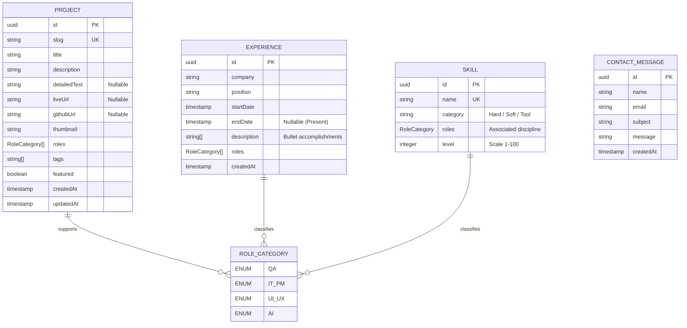

# 04. PERENCANAAN DATABASE & SPESIFIKASI API (DATABASE & API PLANNING)

Dokumen ini mendefinisikan rancangan basis data relasional (skema PostgreSQL), relasi antar entitas, serta spesifikasi detail untuk seluruh RESTful API. Rancangan ini berfungsi sebagai kontrak teknis formal antara tim frontend dan backend selama proses pengembangan.

---

## 1. Rancangan Skema Database (Database Schema Planning)

Database yang digunakan adalah PostgreSQL yang di-host pada layanan Supabase. Hubungan antar data diatur secara terstruktur menggunakan Prisma ORM untuk menjamin integritas data referensial.

### 1.1 Diagram Hubungan Entitas (Entity-Relationship Diagram - ERD)



### 1.2 Detail Tabel & Kolom (Table Dictionary)

#### Tabel: `Project`
Menyimpan informasi proyek yang ditampilkan pada grid halaman utama dan halaman detail khusus.

| Nama Kolom | Tipe Data | Constraints / Key | Deskripsi |
| :--- | :--- | :--- | :--- |
| `id` | `UUID` | PRIMARY KEY, Default: uuid_generate_v4() | Identifikasi unik untuk setiap proyek. |
| `slug` | `VARCHAR(255)` | UNIQUE, NOT NULL | URL-friendly identifier (contoh: `automated-testing-framework`). |
| `title` | `VARCHAR(255)` | NOT NULL | Nama/judul proyek. |
| `description` | `TEXT` | NOT NULL | Deskripsi singkat proyek untuk kartu utama. |
| `detailedText` | `TEXT` | NULLABLE | Studi kasus lengkap dalam format Markdown untuk halaman detail. |
| `liveUrl` | `VARCHAR(512)` | NULLABLE | Tautan ke aplikasi web/situs yang berjalan. |
| `githubUrl` | `VARCHAR(512)` | NULLABLE | Tautan ke repositori kode sumber di GitHub. |
| `thumbnail` | `VARCHAR(512)` | NOT NULL | URL gambar representasi visual proyek. |
| `roles` | `RoleCategory[]` | ARRAY OF ENUM | Daftar peran terkait (QA, IT_PM, UI_UX, AI). |
| `tags` | `VARCHAR(50)[]` | ARRAY OF VARCHAR | Tag teknologi (contoh: `["React", "Playwright", "Zod"]`). |
| `featured` | `BOOLEAN` | NOT NULL, Default: false | Menandai proyek untuk ditampilkan sebagai sorotan utama. |
| `createdAt` | `TIMESTAMP` | NOT NULL, Default: NOW() | Tanggal data dibuat di database. |
| `updatedAt` | `TIMESTAMP` | NOT NULL, Default: NOW() | Tanggal data terakhir diperbarui. |

#### Tabel: `Experience`
Menyimpan riwayat karir dan organisasi untuk timeline.

| Nama Kolom | Tipe Data | Constraints / Key | Deskripsi |
| :--- | :--- | :--- | :--- |
| `id` | `UUID` | PRIMARY KEY, Default: uuid_generate_v4() | Identifikasi unik riwayat kerja. |
| `company` | `VARCHAR(255)` | NOT NULL | Nama perusahaan atau organisasi. |
| `position` | `VARCHAR(255)` | NOT NULL | Nama jabatan atau peran kerja. |
| `startDate` | `TIMESTAMP` | NOT NULL | Tanggal mulai bekerja/aktif. |
| `endDate` | `TIMESTAMP` | NULLABLE | Tanggal selesai bekerja. Null berarti status aktif bekerja ("Present"). |
| `description` | `TEXT[]` | ARRAY OF TEXT | Baris-baris poin pencapaian kerja (*bullet points*). |
| `roles` | `RoleCategory[]` | ARRAY OF ENUM | Kategori disiplin kerja yang relevan pada peran tersebut. |
| `createdAt` | `TIMESTAMP` | NOT NULL, Default: NOW() | Tanggal data dibuat. |

#### Tabel: `Skill`
Menyimpan data daftar keahlian dan persentase untuk divisualisasikan dalam bentuk grafik modern.

| Nama Kolom | Tipe Data | Constraints / Key | Deskripsi |
| :--- | :--- | :--- | :--- |
| `id` | `UUID` | PRIMARY KEY, Default: uuid_generate_v4() | Identifikasi unik baris keahlian. |
| `name` | `VARCHAR(100)` | UNIQUE, NOT NULL | Nama teknologi atau keahlian (contoh: `Figma`). |
| `category` | `VARCHAR(50)` | NOT NULL | Pengelompokan tipe: `Hard Skill`, `Soft Skill`, atau `Tool`. |
| `roles` | `RoleCategory` | ENUM, NOT NULL | Peran utama yang terkait langsung (QA, IT_PM, UI_UX, AI). |
| `level` | `INTEGER` | NOT NULL, Range: 1 - 100 | Nilai persentase penilaian mandiri (*self-assessment*). |

#### Tabel: `ContactMessage`
Menyimpan pesan masuk dari formulir kontak di website.

| Nama Kolom | Tipe Data | Constraints / Key | Deskripsi |
| :--- | :--- | :--- | :--- |
| `id` | `UUID` | PRIMARY KEY, Default: uuid_generate_v4() | Identifikasi unik untuk setiap pesan masuk. |
| `name` | `VARCHAR(255)` | NOT NULL | Nama pengirim pesan. |
| `email` | `VARCHAR(255)` | NOT NULL | Alamat email valid pengirim pesan. |
| `subject` | `VARCHAR(255)` | NOT NULL | Subjek/perihal pesan. |
| `message` | `TEXT` | NOT NULL | Isi teks pesan. |
| `createdAt` | `TIMESTAMP` | NOT NULL, Default: NOW() | Tanggal pesan dikirimkan. |

---

## 2. Spesifikasi REST API (API Contracts)

*   **Protokol**: HTTPS
*   **Base URL**: `https://api.domain.com/api/v1`
*   **Format Konten**: `application/json` (seluruh request dan response)

### 2.1 GET `/projects` (Mengambil Seluruh Proyek)
*   **Tujuan**: Mengambil ringkasan data proyek untuk ditampilkan di grid kartu utama.
*   **Method**: `GET`
*   **Query Parameters**:
    *   `role` (Opsional): Menyaring proyek berdasarkan kategori peran (`QA`, `IT_PM`, `UI_UX`, `AI`).
*   **Request Headers**: Tidak memerlukan autentikasi.
*   **Response Sukses (HTTP 200 OK)**:
    ```json
    [
      {
        "id": "7a7b8c8d-9e0f-1a2b-3c4d-5e6f7a8b9c0d",
        "slug": "ai-testing-automation",
        "title": "AI-Powered Automated Testing Suite",
        "description": "Pengembangan framework pengujian otomatis dengan integrasi OpenAI API untuk deteksi bug otomatis.",
        "thumbnail": "https://supabase.com/storage/v1/object/public/thumbnails/ai-testing.webp",
        "roles": ["QA", "AI"],
        "tags": ["React", "Playwright", "Python", "OpenAI"],
        "featured": true,
        "createdAt": "2026-07-16T14:28:16.000Z"
      }
    ]
    ```
*   **Response Error (HTTP 500 Internal Server Error)**:
    ```json
    {
      "success": false,
      "message": "Terjadi kesalahan internal pada server saat mengambil data proyek."
    }
    ```

### 2.2 GET `/projects/:slug` (Mengambil Detail Proyek Spesifik)
*   **Tujuan**: Mengambil seluruh informasi studi kasus detail dari suatu proyek berdasarkan slug URL.
*   **Method**: `GET`
*   **Request Headers**: Tidak memerlukan autentikasi.
*   **Response Sukses (HTTP 200 OK)**:
    ```json
    {
      "id": "7a7b8c8d-9e0f-1a2b-3c4d-5e6f7a8b9c0d",
      "slug": "ai-testing-automation",
      "title": "AI-Powered Automated Testing Suite",
      "description": "Pengembangan framework pengujian otomatis dengan integrasi OpenAI API.",
      "detailedText": "# AI-Powered Automated Testing Suite\n\n## Overview\nProyek ini mengintegrasikan...",
      "liveUrl": "https://ai-testing.example.com",
      "githubUrl": "https://github.com/developer/ai-testing",
      "thumbnail": "https://supabase.com/storage/v1/object/public/thumbnails/ai-testing.webp",
      "roles": ["QA", "AI"],
      "tags": ["React", "Playwright", "Python", "OpenAI"],
      "featured": true,
      "createdAt": "2026-07-16T14:28:16.000Z",
      "updatedAt": "2026-07-16T14:28:16.000Z"
    }
    ```
*   **Response Error (HTTP 404 Not Found)**:
    ```json
    {
      "success": false,
      "message": "Detail proyek dengan slug 'ai-testing-automation-salah' tidak ditemukan."
    }
    ```

### 2.3 GET `/experience` (Mengambil Riwayat Kerja & Organisasi)
*   **Tujuan**: Mengambil daftar pengalaman kerja dalam urutan waktu terbaru.
*   **Method**: `GET`
*   **Response Sukses (HTTP 200 OK)**:
    ```json
    [
      {
        "id": "1a2b3c4d-5e6f-7a8b-9c0d-1e2f3a4b5c6d",
        "company": "PT Solusi Teknologi Digital",
        "position": "Associate IT Project Manager & QA",
        "startDate": "2025-01-10T00:00:00.000Z",
        "endDate": null,
        "description": [
          "Memimpin koordinasi tim pengembang beranggotakan 6 orang menggunakan metodologi Agile Scrum.",
          "Menyusun skenario pengujian manual dan otomatis menggunakan Postman untuk validasi REST API."
        ],
        "roles": ["IT_PM", "QA"],
        "createdAt": "2026-07-16T14:28:16.000Z"
      }
    ]
    ```

### 2.4 GET `/skills` (Mengambil Matriks Keahlian & Persentase)
*   **Tujuan**: Mengambil seluruh data keahlian untuk visualisasi tingkat pemahaman.
*   **Method**: `GET`
*   **Response Sukses (HTTP 200 OK)**:
    ```json
    [
      {
        "id": "9a8b7c6d-5e4f-3a2b-1c0d-9e8f7a6b5c4d",
        "name": "Manual Testing",
        "category": "Hard Skills",
        "roles": "QA",
        "level": 90
      },
      {
        "id": "8a7b6c5d-4e3f-2a1b-0c9d-8e7f6a5b4c3d",
        "name": "Figma",
        "category": "Tools",
        "roles": "UI_UX",
        "level": 85
      }
    ]
    ```

### 2.5 POST `/contact` (Mengirimkan Pesan Kontak Baru)
*   **Tujuan**: Menerima input dari formulir kontak, memvalidasinya, menyimpannya di database PostgreSQL, dan mengirimkan email notifikasi ke developer.
*   **Method**: `POST`
*   **Request Headers**:
    *   `Content-Type: application/json`
*   **Request Body Payload (JSON)**:
    ```json
    {
      "name": "Alexander TechLead",
      "email": "alexander.lead@company.com",
      "subject": "Penawaran Magang UI/UX & QA",
      "message": "Halo, kami tertarik dengan portfolio Anda dan ingin menawarkan posisi magang di perusahaan kami."
    }
    ```
*   **Response Sukses (HTTP 201 Created)**:
    ```json
    {
      "success": true,
      "message": "Pesan Anda berhasil disimpan dan dikirim. Terima kasih telah menghubungi saya."
    }
    ```
*   **Response Error - Validasi Gagal (HTTP 400 Bad Request)**:
    ```json
    {
      "success": false,
      "message": "Data input tidak valid.",
      "errors": [
        {
          "field": "email",
          "message": "Format alamat email tidak valid."
        },
        {
          "field": "message",
          "message": "Pesan minimal harus terdiri dari 10 karakter."
        }
      ]
    }
    ```
*   **Response Error - Rate Limit (HTTP 429 Too Many Requests)**:
    ```json
    {
      "success": false,
      "message": "Terlalu banyak pengiriman pesan dari perangkat Anda. Silakan coba lagi dalam beberapa menit."
    }
    ```

---

## 3. Logika Skema Validasi Input Zod (Zod Schema Validation)

Sisi server backend menerapkan validasi skema runtime sebelum memproses penyimpanan basis data. Berikut adalah logika deklarasi skema validasi Zod untuk payload formulir kontak:

```javascript
// Deskripsi Logika Validasi Zod (Server-side)
const contactSchema = z.object({
  name: z.string()
    .min(2, "Nama minimal harus terdiri dari 2 karakter.")
    .max(100, "Nama maksimal terdiri dari 100 karakter.")
    .trim(),
  
  email: z.string()
    .email("Format alamat email tidak valid.")
    .trim()
    .toLowerCase(),
  
  subject: z.string()
    .min(4, "Subjek minimal harus terdiri dari 4 karakter.")
    .max(150, "Subjek maksimal terdiri dari 150 karakter.")
    .trim(),
    
  message: z.string()
    .min(10, "Pesan minimal harus terdiri dari 10 karakter.")
    .max(2000, "Pesan maksimal terdiri dari 2000 karakter.")
    .trim()
});
```

Setiap request masuk ke endpoint `POST /contact` yang tidak memenuhi kriteria di atas akan langsung ditolak oleh middleware validasi di backend dengan mengembalikan status `400 Bad Request` beserta detail field yang bermasalah.
